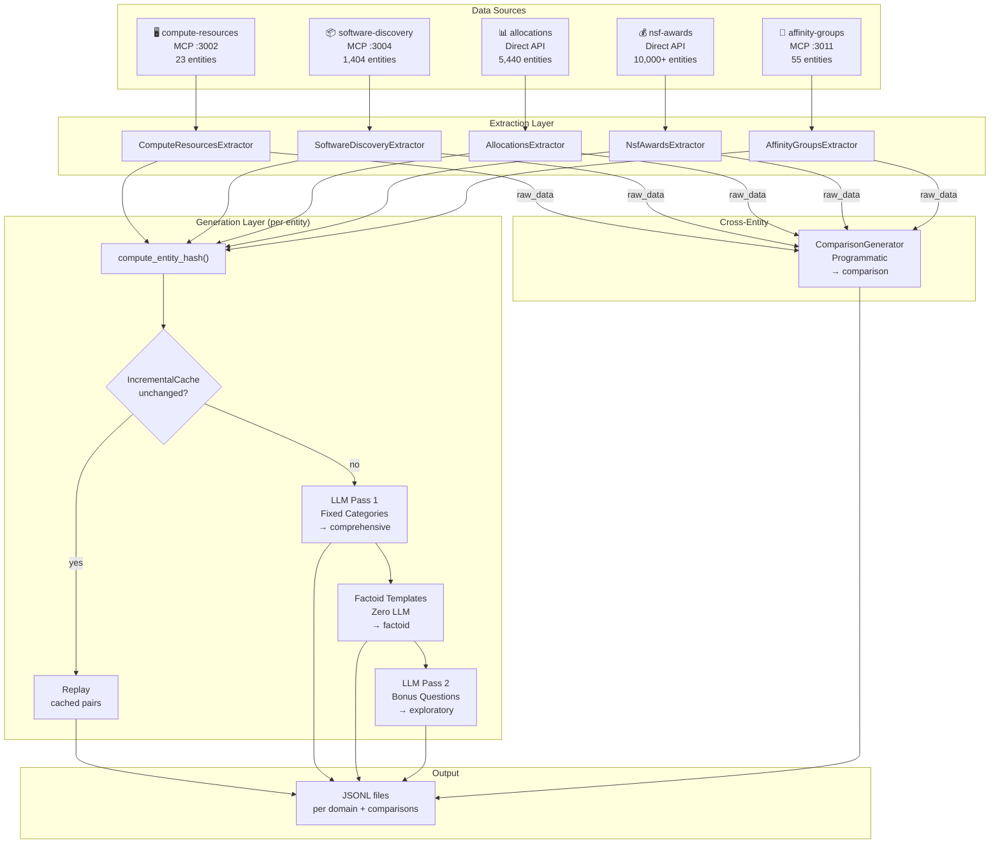
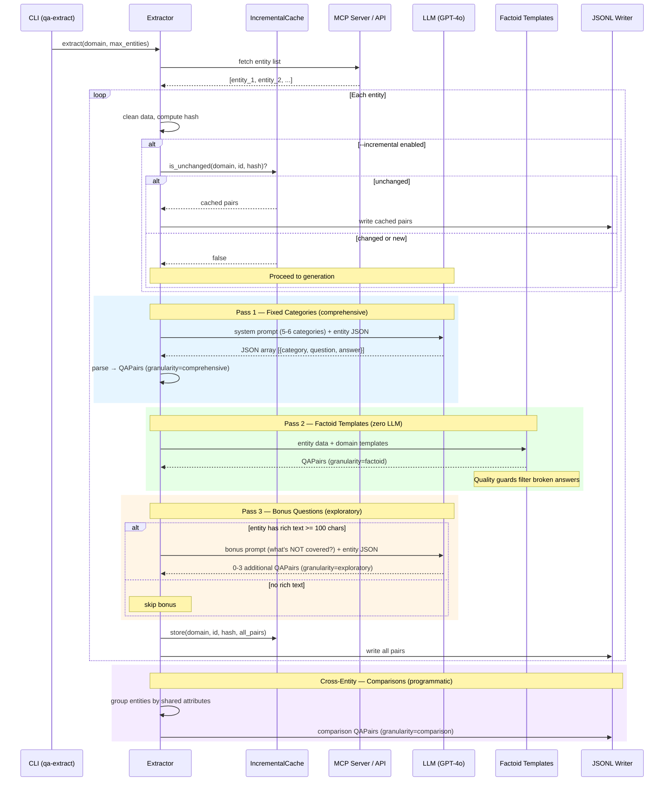

# ACCESS-CI Q&A Extraction Pipeline — System Overview

**Date**: 2026-02-17
**Branch**: `spike/research` @ `93a1fb2`
**Tests**: 169/169 passing

## What This System Does

Extracts Q&A training pairs from 5 ACCESS-CI data domains (HPC resources, software catalog, allocations, NSF awards, community groups) for use in a RAG-based Q&A retrieval system. Produces structured JSONL files with 4 granularity levels designed for different query types.

## Pipeline Architecture



## Per-Entity Extraction Sequence

This is what happens for each entity (e.g., one HPC system, one allocation project):



## Four Granularity Levels

Each targets a different kind of user query in the RAG system:

| Granularity | Generator | LLM? | Purpose | Example Q |
|---|---|---|---|---|
| **comprehensive** | Fixed categories (5-6/domain) | Yes | Broad, topical questions | "What is Delta and what is it designed for?" |
| **factoid** | Templates (6-8/domain) | No | Precise lookup questions | "What type of resource is Ranch?" |
| **exploratory** | Bonus pass (0-3/entity) | Yes | Entity-unique details | "What technology is Ranch based on for archival storage?" |
| **comparison** | ComparisonGenerator | No | Cross-entity questions | "Which ACCESS resources support interactive computing?" |

**Why all four?** RAG retrieval works best with question-to-question matching (QuIM-RAG, 2025). Different query styles need different training pairs. Fine-grained factoids catch "who is the PI?" queries. Comprehensive pairs catch "what resources support materials science?" queries. Exploratory pairs catch long-tail questions about entity-specific details. Comparisons catch "which systems have GPUs?" queries.

## Verification Run (2026-02-17)

`qa-extract extract compute-resources software-discovery allocations nsf-awards affinity-groups --max-entities 2`

| Domain | Comprehensive | Factoid | Exploratory | Comparison | Total |
|---|---|---|---|---|---|
| compute-resources | 10 | 12 | 6 | — | 28 |
| software-discovery | 10 | 14 | 6 | — | 30 |
| allocations | 10 | 16 | 6 | — | 32 |
| nsf-awards | 10 | 16 | 6 | — | 32 |
| affinity-groups | 5 | 10 | 1 | — | 16 |
| comparisons | — | — | — | 3 | 3 |
| **Total** | **45** | **68** | **25** | **3** | **141** |

## Full-Scale Estimate

| Domain | Entities | Est. Pairs | Est. LLM Cost |
|---|---|---|---|
| Compute Resources | 23 | ~345 | ~$0.14 |
| Software Discovery | 1,404 | ~19,000 | ~$8.40 |
| Affinity Groups | 55 | ~670 | ~$0.33 |
| Allocations | 5,440 | ~79,000 | ~$32.60 |
| NSF Awards | 10,000+ | ~145,000 | ~$60.00 |
| **Total** | **~17K** | **~244K** | **~$100** |

With `--incremental`, re-runs cost ~$0 for unchanged entities (hash-based change detection).

## Key Files

```
src/access_qa_extraction/
├── cli.py                          # Typer CLI: extract, report, stats, validate
├── config.py                       # ExtractionConfig, MCPServerConfig
├── models.py                       # QAPair, QAMetadata (4 granularities)
├── mcp_client.py                   # Async HTTP client for MCP servers
├── llm_client.py                   # Anthropic / OpenAI / Local / Transformers
├── question_categories.py          # Fixed categories, prompts, bonus generation
├── citation_validator.py           # Validates <<SRC:domain:id>> citations
├── extractors/
│   ├── base.py                     # BaseExtractor (incremental cache slot)
│   ├── compute_resources.py        # MCP, search_resources({})
│   ├── software_discovery.py       # MCP, list_all_software
│   ├── allocations.py              # Direct API pagination (httpx)
│   ├── nsf_awards.py               # Direct API pagination (httpx)
│   └── affinity_groups.py          # MCP, search_affinity_groups({})
├── generators/
│   ├── comparisons.py              # ComparisonGenerator (programmatic)
│   ├── factoids.py                 # Template-based factoid pairs + quality guards
│   └── incremental.py              # IncrementalCache + compute_entity_hash()
└── output/
    └── jsonl_writer.py             # JSONL file writer
```

## Data Quality Guards

Factoid templates can produce broken answers when upstream data is partial (e.g., `organization_names: [""]` → "Delta is operated by ."). Two layers prevent this:

1. **Hardened field preparers** — filter empty/whitespace strings before joining, filter "Unknown" items, recalculate counts after filtering
2. **Post-format validation** — `_has_quality_defect(answer)` catches trailing punctuation with no content, dangling commas, empty parentheticals, double spaces, and answers shorter than 10 chars

## CLI Quick Reference

```bash
# Full extraction (all domains, all granularities)
qa-extract extract compute-resources software-discovery allocations nsf-awards affinity-groups

# Cheap test run (2 entities per domain)
qa-extract extract compute-resources --max-entities 2

# Skip bonus LLM pass (faster, ~half the LLM cost)
qa-extract extract allocations --no-bonus

# Incremental (skip unchanged entities)
qa-extract extract allocations --incremental

# Dry run (temp directory, no output)
qa-extract extract compute-resources --dry-run

# Inspect output
qa-extract stats data/output/compute-resources_qa_pairs.jsonl
qa-extract validate data/output/compute-resources_qa_pairs.jsonl
```

## Recent Commits (spike/research branch)

| Commit | Description |
|---|---|
| `93a1fb2` | LLM exploratory questions for entity-unique information |
| `068c08a` | Incremental extraction with hash-based change detection |
| `9059614` | Factoid data quality guards for template generation |
| `3662d8b` | Dual-granularity Q&A + comparisons extended to all 5 domains |
| `fa2ff93` | NSF Awards: normalize primaryProgram list + skip unused MCPClient |
| `f3b1437` | Fixed question categories + direct API for allocations/nsf-awards |

## Open Questions for Andrew

### Architecture

1. **Cache storage format** — Currently JSON file (`.extraction_cache.json`). Works fine for small runs. For 17K+ entities, should we switch to SQLite?

2. **Comparison group cap** — Some comparison groups are huge (e.g., "projects at Unknown Institution" with 2,000+ entries). Should we skip groups > N entities? What N?

3. **Bonus question budget** — Currently 0-3 per entity with rich text. Make this configurable via `--max-bonus N`?

### Data Quality

4. **Co-PI email stripping** — NSF co-PI entries include email addresses (e.g., "Jane Doe jane@mit.edu"). Strip before sending to LLM, or leave as-is?

5. **Software Discovery coverage** — `list_all_software` returns 1,404 items. Many are obscure libraries. Should we filter to a curated subset, or generate for all?

### Pipeline / Ops

6. **Stats command granularity breakdown** — `qa-extract stats` currently shows total counts. Should it break down by granularity now that we have 4 levels?

7. **Argilla integration** — Next milestone per planning docs. When to start? Do we want a minimum viable full-scale run first?

8. **Output format** — Currently one JSONL per domain + one for comparisons. Should we also produce a combined file? Per-granularity files?

### Research

9. **Dual-granularity vs single** — QuIM-RAG paper supports question-to-question matching. Do we want to A/B test retrieval with comprehensive-only vs all-four-granularities?

10. **NSF pre-filtering** — `_build_query_params()` has a TODO stub. Should we filter by keywords, date ranges, or specific programs relevant to ACCESS?
