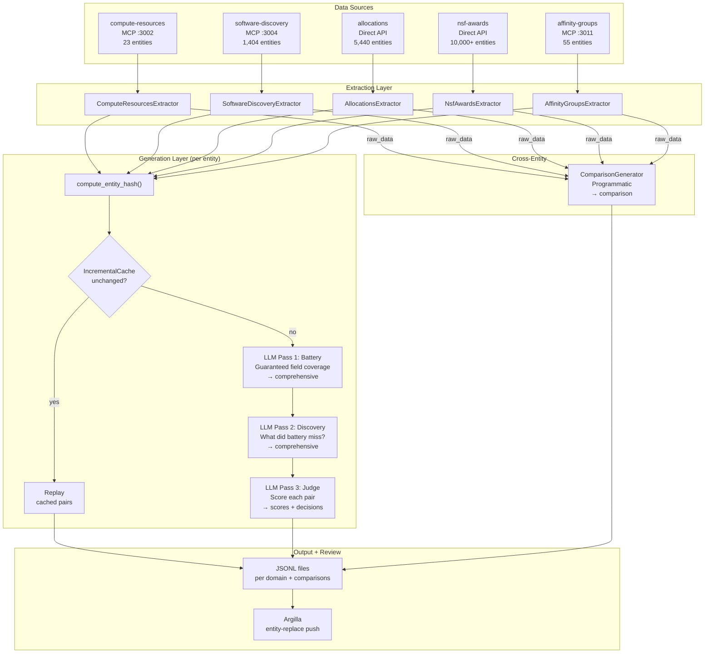
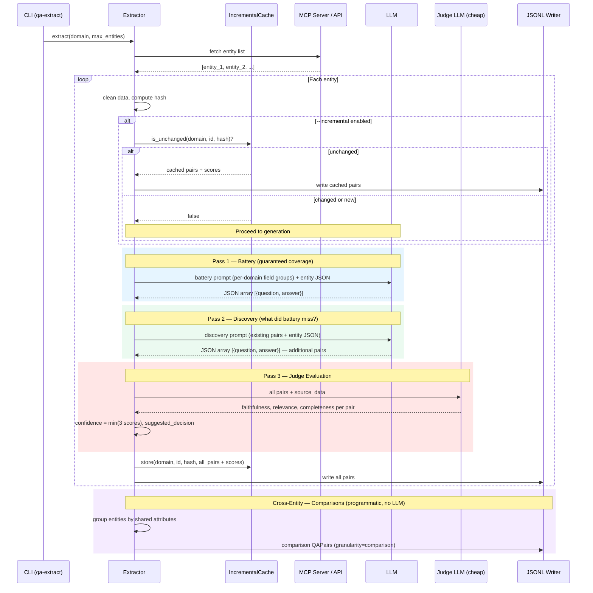

# ACCESS-CI Q&A Extraction Pipeline — System Overview

**Updated**: 2026-02-26
**Branch**: `feat/two-shot`
**Tests**: 144/144 passing

## What This System Does

Extracts Q&A training pairs from 5 ACCESS-CI data domains (HPC resources, software catalog, allocations, NSF awards, community groups) for use in a RAG-based Q&A retrieval system. Produces structured JSONL files with 2 granularity levels (comprehensive + comparison).

## Pipeline Architecture



## Per-Entity Extraction Sequence



## Two Granularity Levels

| Granularity | Generator | LLM? | Purpose | Example Q |
|---|---|---|---|---|
| **comprehensive** | Two-shot LLM (battery + discovery) | Yes | Entity-specific questions, variable count driven by data richness | "What is Delta and what is it designed for?" |
| **comparison** | ComparisonGenerator | No | Cross-entity questions | "Which ACCESS resources support interactive computing?" |

## Two-Shot Extraction Strategy

Each entity gets two LLM passes:

1. **Battery** — per-domain field groups guarantee coverage of key areas (hardware specs, organizations, access methods, etc.). Produces one Q&A pair per applicable field group.
2. **Discovery** — sees the battery output and asks "what interesting, useful Q&A pairs can you find that aren't already covered?" Produces additional pairs for entity-specific details the battery template didn't anticipate.

This replaced the original fixed-category approach, which constrained the LLM to a rigid menu. Two-shot produces more pairs for data-rich entities and fewer for thin ones — pair count scales with data richness.

## Argilla Entity-Replace

When pushing pairs to Argilla for human review:

1. Group pairs by `source_ref` (e.g., `mcp://compute-resources/resources/delta.ncsa.access-ci.org`)
2. For each source_ref, delete existing Argilla records
3. Before deleting, archive any records with human annotations to `qa-review-archive-superseded`
4. Push fresh records

This means the incremental cache is the decision boundary: unchanged entity → skip entirely (human annotations survive). Changed entity → re-extract, replace in Argilla (stale annotations archived).

## LLM Judge Evaluation

After both LLM passes for an entity, all pairs are sent as a batch to a **judge LLM** (cheaper model: gpt-4o-mini or claude-haiku). Scores each pair on three dimensions (0.0–1.0):

- **Faithfulness** — does the answer match the source data?
- **Relevance** — does the answer address the question?
- **Completeness** — does the answer cover the key facts?

**Confidence** = min(faithfulness, relevance, completeness). Threshold 0.8 → `suggested_decision = "approved"` or `"needs_review"`. Skip with `--no-judge`.

## Full-Scale Cost Estimate

Costs assume **gpt-4o-mini** for all three passes (battery, discovery, judge). Two-shot means 2 extraction calls + 1 judge call per entity (3 LLM calls total).

| Domain | Entities | Est. Pairs | Est. Cost (gpt-4o-mini) |
|---|---|---|---|
| Compute Resources | 23 | ~345 | ~$0.28 |
| Software Discovery | 1,404 | ~19,000 | ~$16.80 |
| Affinity Groups | 55 | ~670 | ~$0.66 |
| Allocations | 5,440 | ~79,000 | ~$65.20 |
| NSF Awards | 10,000+ | ~145,000 | ~$120.00 |
| **Total** | **~17K** | **~244K** | **~$203** |

With `--incremental`, re-runs cost ~$0 for unchanged entities. Judge scores are cached alongside pairs.

**Model alternatives:** Using `claude-haiku` for judge only while keeping `gpt-4o-mini` for extraction would have minimal cost impact (~$7 for judge across all entities). Using `gpt-4o` or `claude-sonnet` for extraction would increase costs ~10-20x.

## Key Files

```
src/access_qa_extraction/
├── cli.py                          # Typer CLI: extract, list-servers, stats, validate, push
├── config.py                       # ExtractionConfig, MCPServerConfig
├── models.py                       # QAPair, QAMetadata
├── mcp_client.py                   # Async HTTP client for MCP servers
├── llm_client.py                   # Anthropic / OpenAI / Local / Transformers
├── question_categories.py          # Per-domain field groups, battery/discovery prompt builders
├── citation_validator.py           # Validates <<SRC:domain:id>> citations
├── argilla_client.py               # Entity-replace push to Argilla for human review
├── extractors/
│   ├── base.py                     # BaseExtractor (incremental cache slot)
│   ├── compute_resources.py        # MCP, search_resources({})
│   ├── software_discovery.py       # MCP, list_all_software
│   ├── allocations.py              # Direct API pagination (httpx)
│   ├── nsf_awards.py               # Direct API pagination (httpx)
│   └── affinity_groups.py          # MCP, search_affinity_groups({})
├── generators/
│   ├── comparisons.py              # ComparisonGenerator (programmatic, all 5 domains)
│   ├── incremental.py              # IncrementalCache + compute_entity_hash()
│   └── judge.py                    # LLM judge evaluation (faithfulness/relevance/completeness)
└── output/
    └── jsonl_writer.py             # JSONL file writer
```

## CLI Quick Reference

```bash
# Full extraction (all domains)
qa-extract extract compute-resources software-discovery allocations nsf-awards affinity-groups

# Cheap test run (2 entities per domain, with judge + incremental + Argilla push)
qa-extract extract compute-resources --max-entities 2 --incremental --push-to-argilla

# Skip judge evaluation
qa-extract extract allocations --no-judge

# Incremental only (skip unchanged entities)
qa-extract extract allocations --incremental

# Push existing JSONL to Argilla
qa-extract push data/output/compute-resources_qa_pairs.jsonl

# Inspect output
qa-extract stats data/output/compute-resources_qa_pairs.jsonl
qa-extract validate data/output/compute-resources_qa_pairs.jsonl
```
