# ACCESS-CI Q&A Extraction Pipeline — System Overview

**Date**: 2026-02-17 (updated 2026-02-18)
**Branch**: `spike/freeform-extraction`
**Tests**: 194/194 passing

## What This System Does

Extracts Q&A training pairs from 5 ACCESS-CI data domains (HPC resources, software catalog, allocations, NSF awards, community groups) for use in a RAG-based Q&A retrieval system. Produces structured JSONL files with 3 granularity levels designed for different query types.

## Pipeline Architecture

```mermaid
graph TB
    subgraph "Data Sources"
        MCP1["🖥️ compute-resources<br/>MCP :3002<br/>23 entities"]
        MCP2["📦 software-discovery<br/>MCP :3004<br/>1,404 entities"]
        MCP3["📊 allocations<br/>Direct API<br/>5,440 entities"]
        MCP4["💰 nsf-awards<br/>Direct API<br/>10,000+ entities"]
        MCP5["👥 affinity-groups<br/>MCP :3011<br/>55 entities"]
    end

    subgraph "Extraction Layer"
        E1["ComputeResourcesExtractor"]
        E2["SoftwareDiscoveryExtractor"]
        E3["AllocationsExtractor"]
        E4["NsfAwardsExtractor"]
        E5["AffinityGroupsExtractor"]
    end

    subgraph "Generation Layer (per entity)"
        direction TB
        HASH["compute_entity_hash()"]
        CACHE{"IncrementalCache<br/>unchanged?"}
        LLM["LLM Pass 1<br/>Freeform Extraction<br/>→ comprehensive"]
        FACT["Factoid Templates<br/>Zero LLM<br/>→ factoid"]
        JUDGE["LLM Pass 2<br/>Judge Evaluation<br/>→ scores + decisions"]
        CACHED["Replay<br/>cached pairs"]
    end

    subgraph "Cross-Entity"
        COMP["ComparisonGenerator<br/>Programmatic<br/>→ comparison"]
    end

    subgraph "Output"
        JSONL["JSONL files<br/>per domain + comparisons"]
    end

    MCP1 --> E1
    MCP2 --> E2
    MCP3 --> E3
    MCP4 --> E4
    MCP5 --> E5

    E1 & E2 & E3 & E4 & E5 --> HASH
    HASH --> CACHE
    CACHE -->|yes| CACHED
    CACHE -->|no| LLM
    LLM --> FACT
    FACT --> JUDGE
    CACHED --> JSONL
    JUDGE --> JSONL

    E1 & E2 & E3 & E4 & E5 -->|raw_data| COMP
    COMP --> JSONL
```



## Per-Entity Extraction Sequence

This is what happens for each entity (e.g., one HPC system, one allocation project):

```mermaid
sequenceDiagram
    participant CLI as CLI (qa-extract)
    participant EXT as Extractor
    participant CACHE as IncrementalCache
    participant MCP as MCP Server / API
    participant LLM as LLM (GPT-4o)
    participant TMPL as Factoid Templates
    participant OUT as JSONL Writer

    CLI->>EXT: extract(domain, max_entities)
    EXT->>MCP: fetch entity list
    MCP-->>EXT: [entity_1, entity_2, ...]

    loop Each entity
        EXT->>EXT: clean data, compute hash

        alt --incremental enabled
            EXT->>CACHE: is_unchanged(domain, id, hash)?
            alt unchanged
                CACHE-->>EXT: cached pairs
                EXT->>OUT: write cached pairs
            else changed or new
                CACHE-->>EXT: false
                Note over EXT,LLM: Proceed to generation
            end
        end

        rect rgb(230, 245, 255)
            Note over EXT,LLM: Pass 1 — Freeform Extraction (comprehensive)
            EXT->>LLM: freeform prompt (categories as guidance, not constraint) + entity JSON
            LLM-->>EXT: JSON array [{question, answer}] — variable count driven by data richness
            EXT->>EXT: parse → QAPairs (granularity=comprehensive, sequential IDs)
        end

        rect rgb(230, 255, 230)
            Note over EXT,TMPL: Pass 2 — Factoid Templates (zero LLM)
            EXT->>TMPL: entity data + domain templates
            TMPL-->>EXT: QAPairs (granularity=factoid)
            Note over TMPL: Quality guards filter broken answers
        end

        rect rgb(255, 230, 230)
            Note over EXT,LLM: Pass 3 — Judge Evaluation (scores)
            EXT->>LLM: all pairs + source_data for this entity
            LLM-->>EXT: faithfulness, relevance, completeness per pair
            EXT->>EXT: confidence = min(3 scores), suggested_decision
        end

        EXT->>CACHE: store(domain, id, hash, all_pairs + scores)
        EXT->>OUT: write all pairs
    end

    rect rgb(245, 235, 255)
        Note over EXT,OUT: Cross-Entity — Comparisons (programmatic)
        EXT->>EXT: group entities by shared attributes
        EXT->>OUT: comparison QAPairs (granularity=comparison)
    end
```



## Three Granularity Levels

Each targets a different kind of user query in the RAG system:

| Granularity | Generator | LLM? | Purpose | Example Q |
|---|---|---|---|---|
| **comprehensive** | Freeform LLM pass (variable count) | Yes | Broad + entity-specific questions | "What is Delta and what is it designed for?" |
| **factoid** | Templates (6-8/domain) | No | Precise lookup questions | "What type of resource is Ranch?" |
| **comparison** | ComparisonGenerator | No | Cross-entity questions | "Which ACCESS resources support interactive computing?" |

**Why three?** RAG retrieval works best with question-to-question matching (QuIM-RAG, 2025). Different query styles need different training pairs. The freeform LLM pass now covers both broad topical questions and entity-unique details (previously split across "comprehensive" and "exploratory" passes). Factoids catch precise lookup queries. Comparisons catch cross-entity queries.

**Previous approach (deprecated):** The old 4-pass pipeline had fixed categories + a bonus "exploratory" pass capped at 3 pairs. The freeform approach merged these into a single LLM call that produces variable pair counts driven by data richness (see `docs/design-extraction-rethink-2026-02-18.md`).

## Verification Run (2026-02-18, freeform extraction)

`qa-extract extract compute-resources software-discovery allocations nsf-awards affinity-groups --max-entities 2 --push-to-argilla -o data/output/all-domains-freeform/`

| Domain | Comprehensive | Factoid | Comparison | Total |
|---|---|---|---|---|
| compute-resources | 16 | 12 | — | 28 |
| software-discovery | 20 | 14 | — | 34 |
| allocations | 23 | 16 | — | 39 |
| nsf-awards | 22 | 16 | — | 38 |
| affinity-groups | 10 | 10 | — | 20 |
| comparisons | — | — | 3 | 3 |
| **Total** | **91** | **68** | **3** | **162** |

Note: The `--push-to-argilla` resulted in 0 records pushed (162 skipped as duplicates due to a dedup bug). See `docs/design-extraction-rethink-2026-02-18.md` Part 1.5.

## Full-Scale Estimate

| Domain | Entities | Est. Pairs | Est. LLM Cost |
|---|---|---|---|
| Compute Resources | 23 | ~345 | ~$0.14 |
| Software Discovery | 1,404 | ~19,000 | ~$8.40 |
| Affinity Groups | 55 | ~670 | ~$0.33 |
| Allocations | 5,440 | ~79,000 | ~$32.60 |
| NSF Awards | 10,000+ | ~145,000 | ~$60.00 |
| **Total** | **~17K** | **~244K** | **~$100** |
| **+ Judge** | — | — | **~$7** |

With `--incremental`, re-runs cost ~$0 for unchanged entities (hash-based change detection). Judge scores are cached alongside pairs.

## Key Files

```
src/access_qa_extraction/
├── cli.py                          # Typer CLI: extract, report, stats, validate
├── config.py                       # ExtractionConfig, MCPServerConfig
├── models.py                       # QAPair, QAMetadata (4 granularities)
├── mcp_client.py                   # Async HTTP client for MCP servers
├── llm_client.py                   # Anthropic / OpenAI / Local / Transformers
├── question_categories.py          # Categories (as guidance), freeform prompts
├── citation_validator.py           # Validates <<SRC:domain:id>> citations
├── extractors/
│   ├── base.py                     # BaseExtractor (incremental cache slot)
│   ├── compute_resources.py        # MCP, search_resources({})
│   ├── software_discovery.py       # MCP, list_all_software
│   ├── allocations.py              # Direct API pagination (httpx)
│   ├── nsf_awards.py               # Direct API pagination (httpx)
│   └── affinity_groups.py          # MCP, search_affinity_groups({})
├── generators/
│   ├── comparisons.py              # ComparisonGenerator (programmatic)
│   ├── factoids.py                 # Template-based factoid pairs + quality guards
│   ├── incremental.py              # IncrementalCache + compute_entity_hash()
│   └── judge.py                    # LLM judge evaluation (faithfulness/relevance/completeness)
└── output/
    └── jsonl_writer.py             # JSONL file writer
```

## Data Quality Guards

Factoid templates can produce broken answers when upstream data is partial (e.g., `organization_names: [""]` → "Delta is operated by ."). Two layers prevent this:

1. **Hardened field preparers** — filter empty/whitespace strings before joining, filter "Unknown" items, recalculate counts after filtering
2. **Post-format validation** — `_has_quality_defect(answer)` catches trailing punctuation with no content, dangling commas, empty parentheticals, double spaces, and answers shorter than 10 chars

## LLM Judge Evaluation

After all pairs for an entity are generated (comprehensive + factoid), they're sent as a batch to a **judge LLM** for quality scoring. The judge uses a cheaper model by default (gpt-4o-mini or claude-haiku) and scores each pair on three dimensions (0.0-1.0):

- **Faithfulness** — does the answer match the source data?
- **Relevance** — does the answer address the question?
- **Completeness** — does the answer cover the key facts?

**Confidence** = min(faithfulness, relevance, completeness). If confidence >= 0.8, `suggested_decision = "approved"`. Otherwise, `"needs_review"`. These scores flow into the JSONL output and will drive Argilla review triage.

Configured via env vars `LLM_JUDGE_BACKEND` and `LLM_JUDGE_MODEL`. Skip with `--no-judge`.

## CLI Quick Reference

```bash
# Full extraction (all domains, all granularities)
qa-extract extract compute-resources software-discovery allocations nsf-awards affinity-groups

# Cheap test run (2 entities per domain)
qa-extract extract compute-resources --max-entities 2

# Skip judge evaluation (no quality scores on pairs)
qa-extract extract allocations --no-judge

# Incremental (skip unchanged entities)
qa-extract extract allocations --incremental

# Dry run (temp directory, no output)
qa-extract extract compute-resources --dry-run

# Inspect output
qa-extract stats data/output/compute-resources_qa_pairs.jsonl
qa-extract validate data/output/compute-resources_qa_pairs.jsonl
```

## Recent Commits (spike/research branch)

| Commit | Description |
|---|---|
| `93a1fb2` | LLM exploratory questions for entity-unique information |
| `068c08a` | Incremental extraction with hash-based change detection |
| `9059614` | Factoid data quality guards for template generation |
| `3662d8b` | Dual-granularity Q&A + comparisons extended to all 5 domains |
| `fa2ff93` | NSF Awards: normalize primaryProgram list + skip unused MCPClient |
| `f3b1437` | Fixed question categories + direct API for allocations/nsf-awards |

## Open Questions for Andrew

### Architecture

1. **Cache storage format** — Currently JSON file (`.extraction_cache.json`). Works fine for small runs. For 17K+ entities, should we switch to SQLite?

2. **Comparison group cap** — Some comparison groups are huge (e.g., "projects at Unknown Institution" with 2,000+ entries). Should we skip groups > N entities? What N?

### Data Quality

4. **Co-PI email stripping** — NSF co-PI entries include email addresses (e.g., "Jane Doe jane@mit.edu"). Strip before sending to LLM, or leave as-is?

5. **Software Discovery coverage** — `list_all_software` returns 1,404 items. Many are obscure libraries. Should we filter to a curated subset, or generate for all?

### Pipeline / Ops

6. **Stats command granularity breakdown** — `qa-extract stats` currently shows total counts. Should it break down by granularity now that we have 4 levels?

7. **Argilla integration** — Semantic dedup ruled out (only compares questions, blocks updated answers). Entity-replace by `source_ref` is the decided approach. Implementation needed. See `docs/design-extraction-rethink-2026-02-18.md`.

8. **Output format** — Currently one JSONL per domain + one for comparisons. Should we also produce a combined file? Per-granularity files?

### Research

9. **Retrieval testing** — QuIM-RAG paper supports question-to-question matching. Do we want to A/B test retrieval with comprehensive-only vs comprehensive+factoid?

10. **NSF pre-filtering** — `_build_query_params()` has a TODO stub. Should we filter by keywords, date ranges, or specific programs relevant to ACCESS?
